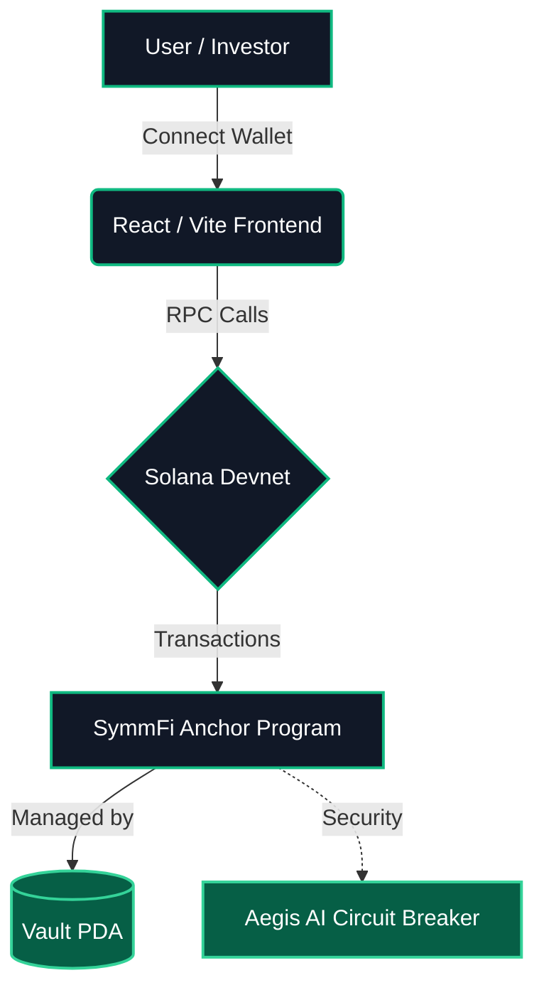
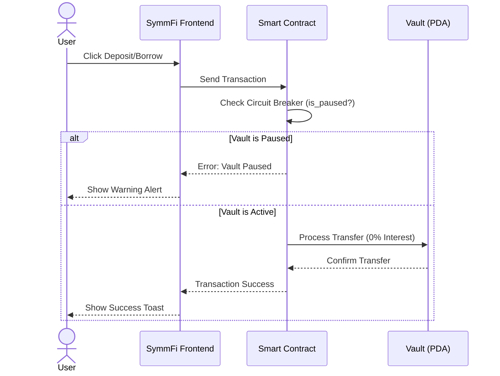
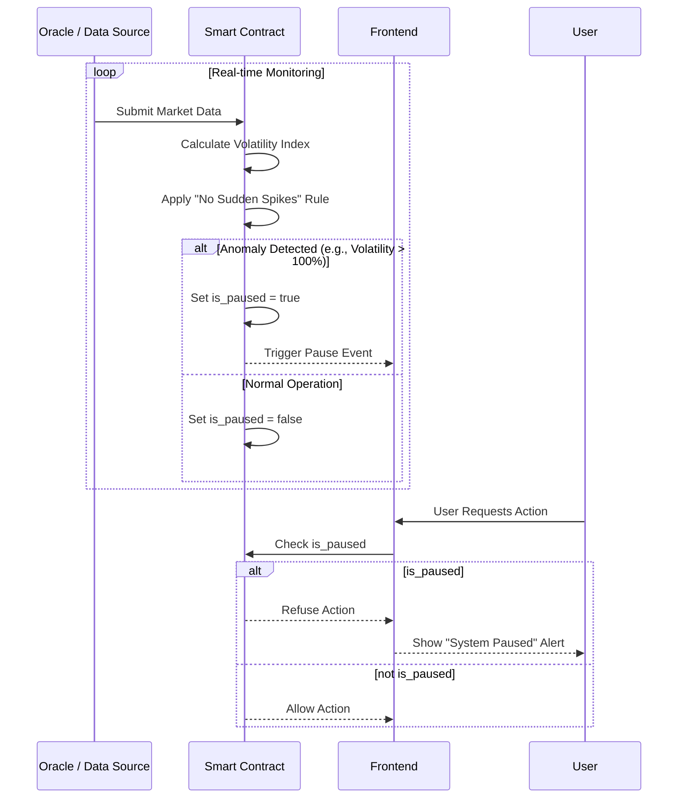

# ⚖️ SymmFi - Symmetrical Finance

> **The Zero-Interest, Real-Yield DeFi Protocol on Solana.**

SymmFi completely reimagines decentralized finance by eliminating predatory interest rates and liquidation risks. We replace traditional lending mechanics with a profit-sharing model, protected by an AI-driven Circuit Breaker.

---

## 🔗 Quick Links
* 🌐 **Live Demo:** [ Demo URL Here](#)
* 🎥 **Pitch/Demo Video:** [ Video URL Here](#)

---

## 🚀 The Problem vs. The Solution

* **The Problem:** Traditional DeFi relies on over-collateralization and high, unpredictable interest rates. Borrowers face constant liquidation threats, while investors earn yield from the suffering of borrowers.
* **The Solution:** SymmFi introduces **0% interest loans**. Instead of paying interest, borrowers (institutions/traders) share a portion of their generated profit (Real Yield) back to the protocol vault, which is then distributed to the co-investors. 

---

## ⚙️ Core Features
* 💸 **Zero-Interest Borrowing:** Borrow funds without the stress of accumulating interest.
* 🤝 **Co-Investment Vaults:** Investors deposit assets to earn a share of the real profit generated by the protocol's institutional borrowers.
* 🛡️ **Aegis AI Circuit Breaker:** An algorithmic security measure that automatically pauses the Vault (`is_paused = true`) if irregular market activities or malicious attempts are detected.
* ⚡ **Frictionless UX:** Built on React/Vite with Solana Wallet Adapter for lightning-fast, ultra-low fee transactions.

---

## 📊 System Visualizations

### 1. System Architecture

### 2. User Flow (Deposit & Borrow)

### 3. Aegis Circuit Breaker Logic

## 🏗️ Architecture & Tech Stack
* **Smart Contract:** Rust & Anchor Framework.
* **Frontend:** React.js, Vite, TailwindCSS, Framer Motion.
* **Blockchain:** Solana Devnet.
* **Core Logic:** Program Derived Addresses (PDAs) for secure Vault and User State management.

## 📍 Deployed Contract (Devnet)
**Program ID:** `3gP9QwfQCm4nTiwQfKanjbzTUyTMNhPr4crKeqP8Mrch`
**Test USDC Mint (Dummy Token):** `44ECEHW4wGauZ7TtjzBVC5TJLVU1aT7RPcqKXYreMN3y4`

## 💻 Getting Started (Local Development)

### Frontend Setup
1. `npm install`
2. Set your `.env` variables (VITE_PROGRAM_ID, VITE_CUSTOM_TOKEN_MINT).
3. `npm run dev`

### Anchor Program Setup
1. `cd anchor`
2. `anchor build`
3. `anchor test`